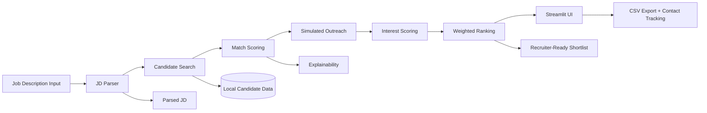

# AI-Powered Talent Scouting & Engagement Agent

Local AI hiring assistant that turns a job description into a ranked shortlist of candidates, with explainable scoring and simulated outreach.

## 1-Minute Judge Quick Start

Use these exact commands in two terminals.

### Terminal 1

```bash
ollama serve
```

### Terminal 2

```bash
cd talent-agent
python3 -m venv .venv
source .venv/bin/activate
pip install -r requirements.txt
ollama pull llama3
ollama pull nomic-embed-text
export PYTHONPATH=$PYTHONPATH:$(pwd)
streamlit run app.py --server.port 8501
```

Open: http://localhost:8501

You should see:

- dashboard loads successfully
- pipeline stages run live
- ranked shortlist appears with explanation

This project is built for the Catalyst problem statement:

- JD parsing
- Candidate discovery
- Matching with explainability
- Simulated conversational outreach
- Combined ranked output recruiters can act on immediately

## What the prototype does

1. Parses a free-form job description into structured fields.
2. Searches a local candidate pool using embeddings and semantic similarity.
3. Scores each candidate using deterministic match logic.
4. Simulates recruiter-candidate outreach to estimate interest.
5. Combines match + interest into a final shortlist score.
6. Shows live execution stages in the UI so the recruiter can see what is happening.
7. Exports the shortlist to CSV and allows recruiter actions such as marking candidates as contacted.

## Submission Checklist

| Requirement | Status |
| --- | --- |
| Working prototype | Yes, runs locally with Streamlit |
| Deployed URL or local setup instructions | Local setup instructions included below |
| Source code in a public repo with README | This repository can be published as-is |
| 3–5 minute demo video | Add your final demo link in the placeholder below |
| Architecture diagram and scoring logic | Included below |
| Sample inputs and outputs | Included below |

## Download Source Code

Choose one of the two options below.

### Option A: Clone with Git (recommended)

```bash
git clone <YOUR_PUBLIC_REPO_URL>
cd talent-agent
```

### Option B: Download ZIP from GitHub

1. Open your repository page on GitHub.
2. Click `Code` -> `Download ZIP`.
3. Extract the ZIP.
4. Open terminal inside the extracted `talent-agent` folder.

## System Requirements

- macOS, Linux, or Windows
- Python 3.10+
- `pip` (Python package installer)
- Ollama

## Install Ollama (Required)

Use one of these methods based on your OS.

### macOS

1. Install from official website: https://ollama.com/download
2. Or via Homebrew:

```bash
brew install ollama
```

### Linux

```bash
curl -fsSL https://ollama.com/install.sh | sh
```

### Windows

1. Install from official website: https://ollama.com/download
2. Run the installer and restart terminal.

Verify installation:

```bash
ollama --version
```

Start Ollama server:

```bash
ollama serve
```

Pull required models (first-time setup):

```bash
ollama pull llama3
ollama pull nomic-embed-text
```

Verify Ollama is healthy:

```bash
curl -s http://127.0.0.1:11434/api/tags | head
```

## Run Everything (From Scratch)

After downloading/cloning, run these steps in order.

### Step 1: Create environment and install dependencies

```bash
cd talent-agent
python3 -m venv .venv
source .venv/bin/activate
pip install -r requirements.txt
```

This command installs all Python requirements defined in `requirements.txt` (for example: `streamlit`, `requests`, `numpy`, `faiss-cpu`).

### Step 2: Start Ollama and pull models

```bash
ollama serve
```

In another terminal:

```bash
ollama pull llama3
ollama pull nomic-embed-text
```

### Step 3: Start the Streamlit app

```bash
cd talent-agent
source .venv/bin/activate
export PYTHONPATH=$PYTHONPATH:$(pwd)
streamlit run app.py --server.port 8501
```

Open:

- http://localhost:8501

## Quickstart (Copy-Paste)

Use this exact sequence for a reliable local run.

### Terminal 1: start Ollama

```bash
ollama serve
```

If first run, pull models once:

```bash
ollama pull llama3
ollama pull nomic-embed-text
```

### Terminal 2: start the app

```bash
cd /path/to/your/workspace/talent-agent
python3 -m venv .venv
source .venv/bin/activate
pip install -r requirements.txt
export PYTHONPATH=$PYTHONPATH:$(pwd)
streamlit run app.py --server.port 8501
```

Open:

- http://localhost:8501

Expected success:

- Streamlit shows the dashboard
- Pipeline stages appear live: JD Parsing -> Discovery -> Matching -> Outreach -> Scoring -> Ranking -> Complete

### Optional one-line smoke test (without UI)

```bash
cd /path/to/your/workspace/talent-agent
source .venv/bin/activate
export PYTHONPATH=$PYTHONPATH:$(pwd)
python3 -c "from core.agent import TalentAgent; out=TalentAgent().run('Need backend engineer with Python Django SQL, 3 years', top_k=3); print(len(out['results']))"
```

## Demo Video

Add your walkthrough video link here before submission:

- Demo video URL: `PASTE_YOUR_DEMO_VIDEO_LINK_HERE`

Recommended demo flow:

1. Enter a sample JD.
2. Show live stage updates: JD Parsing -> Discovery -> Matching -> Outreach -> Ranking.
3. Open one or two candidate cards and explain the scoring.
4. Show the CSV export and contact tracking actions.

## Architecture Overview



### Component Roles

- `core/agent.py`: Orchestrates the whole pipeline and emits live progress updates.
- `modules/jd_parser.py`: Extracts role, skills, and experience from the JD.
- `modules/search.py`: Uses embeddings and FAISS-style similarity search to find candidate matches.
- `modules/matcher.py`: Produces deterministic skill and experience match scores.
- `modules/engagement.py`: Simulates recruiter-candidate conversation.
- `modules/interest.py`: Converts conversation text into an interest score.
- `modules/ranking.py`: Combines scoring dimensions and generates recruiter-facing explanations.
- `app.py`: Streamlit interface with live stage updates, shortlist export, and recruiter actions.

## Scoring Logic

The final shortlist score is built from two primary dimensions:

- Match Score: how well the candidate fits the JD
- Interest Score: how likely the candidate is to engage positively

### Match Score

Match Score is a weighted combination of:

- Skill Score: overlap between JD skills and candidate skills
- Experience Score: how close the candidate’s experience is to the JD requirement

Formula:

Match Score = 0.7 * Skill Score + 0.3 * Experience Score

### Final Ranking

The final shortlist score combines the two top-level dimensions:

Final Score = 0.6 * Match Score + 0.4 * Interest Score

### Explainability

For each candidate, the shortlist shows:

- matched skills
- missing skills
- skill coverage
- experience gap
- recommendation label
- conversation transcript

### Recommendation Labels

The ranking layer assigns an action-oriented recommendation:

- Fast-track to interview
- Proceed to recruiter screen
- Keep in warm shortlist
- Low priority

## Live Execution Stages

The UI shows the pipeline as it runs so the recruiter can see exactly what is being executed:

1. JD Parsing
2. Discovery
3. Matching
4. Outreach
5. Scoring
6. Ranking
7. Complete

## Local Setup

### Prerequisites

- Python 3.10+
- Ollama installed locally (see **Install Ollama (Required)** above)
- A terminal and browser

### 1) Install dependencies

```bash
cd talent-agent
pip install -r requirements.txt
```

### 2) Start Ollama

Open a second terminal and run:

```bash
ollama serve
```

Pull the required models if they are not already available:

```bash
ollama pull llama3
ollama pull nomic-embed-text
```

### 3) Run the Streamlit app

```bash
cd talent-agent
streamlit run app.py
```

Open the app in your browser:

- http://localhost:8501

### 4) Optional CLI run

```bash
python main.py
```

Or pass a JD directly:

```bash
python main.py "Looking for Python backend developer with Django and SQL, 2 years experience"
```

## Troubleshooting

### `Port 8501 is already in use`

```bash
lsof -i :8501
kill <PID>
streamlit run app.py --server.port 8501
```

Or run on a different port:

```bash
streamlit run app.py --server.port 8502
```

### `Error: File does not exist: app.py`

You are not in the project directory. Run:

```bash
cd /path/to/your/workspace/talent-agent
streamlit run app.py --server.port 8501
```

### Pipeline timeout or no response from model

1. Ensure Ollama is running:

```bash
curl -s http://127.0.0.1:11434/api/tags | head
```

2. Reduce shortlist size in sidebar (for faster demo runs).
3. Verify required models are present (`llama3`, `nomic-embed-text`).

### Dependency or import issues

```bash
cd /path/to/your/workspace/talent-agent
source .venv/bin/activate
pip install -r requirements.txt
export PYTHONPATH=$PYTHONPATH:$(pwd)
```

## Configuration

Useful environment variables:

- `STRICT_OLLAMA=1` to fail fast if Ollama embeddings are unavailable.
- `USE_LLM_CONVERSATION=1` to enable LLM-based simulated outreach.
- `OLLAMA_TIMEOUT_SECONDS=20` to reduce or increase Ollama request timeout.

Examples:

```bash
STRICT_OLLAMA=1 python main.py
USE_LLM_CONVERSATION=1 streamlit run app.py
```

## Testing

Run the unit tests:

```bash
python -m unittest discover -s tests
```

## Sample Input

```text
Need 5 data engineer profiles with 4+ years of experience in SQL, Django, Python, and AWS.
```

## Sample Output

```json
{
	"parsed_jd": {
		"role": "Data Engineer",
		"skills": ["sql", "django", "python", "aws"],
		"experience_years": 4
	},
	"results": [
		{
			"name": "Neha Iyer",
			"match_score": 82.5,
			"interest_score": 73,
			"final_score": 78.7,
			"skill_score": 85,
			"experience_score": 75,
			"skill_coverage": 75,
			"experience_gap": 1,
			"recommendation": "Proceed to recruiter screen",
			"explanation": [
				"Matches python, django",
				"Missing aws",
				"Highly interested",
				"Proceed to recruiter screen"
			],
			"conversation": [
				{"speaker": "recruiter", "message": "Hi Neha Iyer, are you open to a Data Engineer opportunity?"},
				{"speaker": "candidate", "message": "Yes, I am interested and would like to know the team expectations."}
			]
		}
	]
}
```

## What recruiters can do in the UI

- View the parsed JD.
- See the ranked shortlist with explanation.
- Download the shortlist as CSV.
- Mark candidates as contacted.
- Inspect the simulated conversation for each candidate.

## Project Structure

- `app.py` - Streamlit UI
- `main.py` - CLI entry point
- `core/` - orchestration and configuration
- `modules/` - JD parsing, search, matching, outreach, ranking
- `llm/` - Ollama client and embeddings helpers
- `memory/` - conversation persistence
- `data/` - candidate dataset
- `tests/` - unit tests

## Notes for Submission

- If you have a deployed version, replace the local URL section with the hosted link.
- Replace the demo video placeholder before submitting.
- If you want a one-line summary for the demo slide, use:

> AI agent that parses a JD, discovers and ranks candidates, simulates outreach, and returns a recruiter-ready shortlist with explainable scoring.

